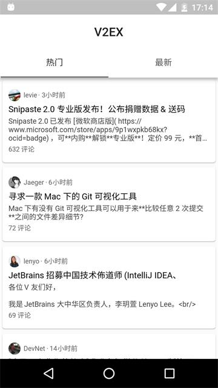
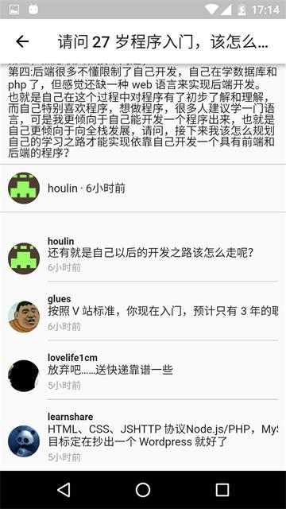

V2EX Flutter Demo
===============

## 关于Demo

该 Demo 旨在学习 flutter ，以及研究flutter的实用性。

从学习 flutter 到编写完该 demo 总计耗时3天，易上手。

设计理念优秀，UI 组建全部以 widget 形式呈现，非 UI 组建也可以是 widget，API设计规范统一，优秀。

### app 预览







### app 下载

下载最新的release https://github.com/onlynight/v2ex_flutter_demo/releases

### 相关项目

使用 V2EX 接口项目地址: https://github.com/djyde/V2EX-API

之前写的一个 MVVM 模式的 V2EX android demo 项目地址： https://github.com/onlynight/V2EX

## Flutter 

这是一个用 ```flutter``` 写的 V2EX 客户端 app。旨在学习 flutter ，以及研究flutter的实用性。对比了 React Native ， Weex 和 Flutter ，Flutter 优势很明显，具体有以下几点：

1. 性能表现优异（目前只测试android端，ios暂时没有测试，估计性能会比android更优秀）
2. 教程文档全中文
3. 社区友好，文档齐全
4. 大厂 google 负责开发维护
5. 高校 UI 编写（虽然没有从开发框架层面做MVC，直接使用代码编写界面，但是设计理念优秀，特别适合app开发人员学习，深入）
6. 综上，非常优秀的大前端框架，优秀。